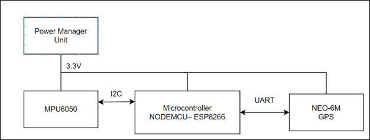

# Fall Detection and Real-Time Location Tracker

This project aims to develop a **wearable device** that provides real-time location tracking and accurate fall detection to enhance safety. It prioritizes reliability by reducing false alarms and promptly alerting emergency contacts when a fall is detected.

---

## Features

- **Language**: Written in C
- **Compilation**: Uses the Arduino IDE for code compilation

---

## Software Requirements Specification

### Project Overview

- **Purpose**  
  The wearable device is designed to improve safety for individuals at risk of falls by accurately detecting falls and instantly tracking location. It aims to reduce emergency response times, enabling rapid assistance through precise, real-time location data.

- **Scope**  
  This project focuses on:
  - Building a foundational understanding of **rotation** and **acceleration** measurements.
  - Developing essential skills in **embedded systems design**.

- **Glossary and References**  
  Refer to the `/References` folder for terms and sources used in the project.

### Overall Description

- **User Needs**  
  Users need a rapid response system that detects falls accurately, providing timely assistance to minimize adverse effects. The device is designed to be worn on the **waist** or **wrist**.

- **Assumptions and Dependencies**  
  - **Power Source**: A 3.7V 18650 lithium battery will power the device, requiring regular charging.
  - **Connectivity**: Information is transmitted via Wi-Fi due to easier configuration compared to GSM, which varies across regions.
  - **Sensor Compatibility**: Sensors and actuators work efficiently with 3.3V microcontrollers.

### Features and Requirements

- **Functional Requirements**
  - **MPU6050 Module**: Data filtering is essential to reduce noise for reliable fall detection.
  - **NEO-6M GPS Module**: Requires open spaces for optimal satellite data reception.
  - **ESP8266 Wi-Fi Module**: Wi-Fi credentials should be updated via a mobile app.
  - **Real-time Processing**: The fall detection algorithm must efficiently process real-time data for prompt action.

- **Non-functional Requirements**
  - **Low Power Consumption**: Prolong battery life through optimized power usage.
  - **Alternative Connectivity**: Options like LoRa, Zigbee, or GSM (if feasible) to reduce reliance on Wi-Fi.
  - **Memory Efficiency**: Ensure minimal memory use to improve processing speed and reliability.

- **External Interface Requirements**  
  

---

## Installation

- **Mobile App**  
  - Access the `/Mobile App` folder for the `.aia` file.
  - Use the [MIT App Inventor](https://appinventor.mit.edu/) website to open and run the project.

- **ESP Code**  
  - Access the `/Main code` folder for the embedded code needed for the ESP8266 module.

---

## Contributors

- **Truong Huu Truong Son** – 21522559
- **Do Thanh Son** – 21522551